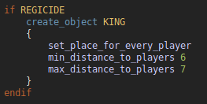

# highlight.js-rms
rms syntax highlighting via highlight.js

## Usage

Get [highlight.js](https://github.com/highlightjs).

Include `highlight.js` and the `highlight.js-rms.js` file from this repository
in your website. Initialize `highlight.js` and add the rms language as custom 
language.

See `index.html` for an example. Check the highlight.js documentation for more
options.
